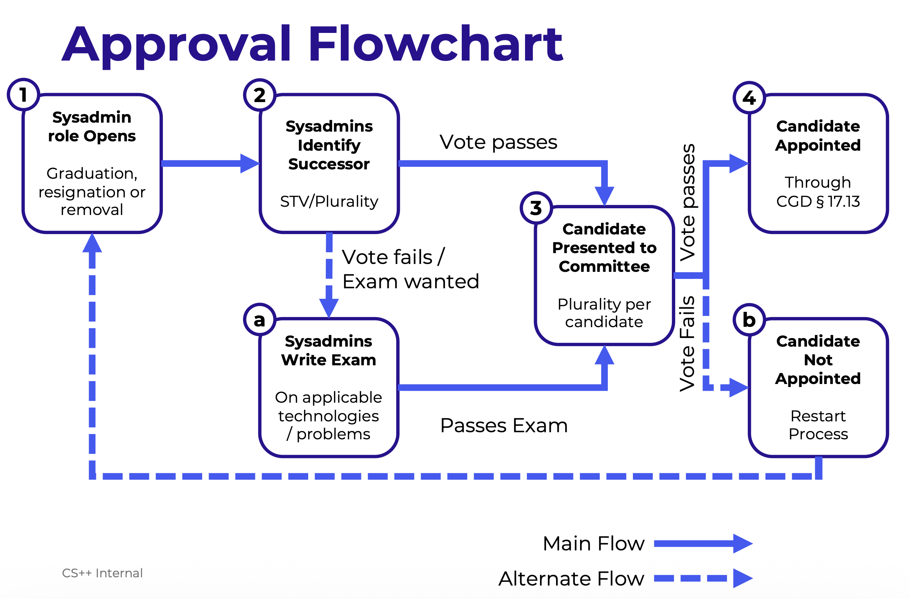

# Systems Administrator

Systems Administrators (Or Sysadmins) are a special role within CS++ as defined in Article V of CS++'s Constitution.

Rather than being elected by popular vote, Sysadmins are chosen internally through a process as outlined in the Constitution (Sections 5.03 - 5.12). A flowchart of this is available below:

This full document can be found [here](../res/sysadminRefactor.pdf).

# Roles and Responsibilities

Sysadmins are responsible for managing all of the infrastructure owned by CS++. Chiefly, they are the 'rootholders', meaning they have full admin permissions on the infrastructure.

The sysadmin team is a 5-person strong sub-committee within CS++ who operate with a flat hierarchy (There is no chief sysadmin or single leader). Instead, individual services / areas of administration have 'owners' who lead that relevant area.

Sysadmins are also the only Committee members who are allowed to vote on decisions related to the technical stack. This includes (but is not limited to):

- Who has access
- The hardware & software stack
- The services being run for CS++, its members, and other Student Life Groups

The Sysadmins remain answerable to the committee as a whole, and remain subordinate to the Core Committee, and especially the Chairperson.

In matters of finance, health & safety and non-technical decisions, sysadmins must seek approval from the remainder of the committee.

Sysadmins may delegate or adopt other committee members and allow them access to the infrastructure.

Both Sysadmins and non-sysadmins are allowed to work on CS++ software, see CS++'s [development philosophy](https://docs.cspp.ie/development/dev-vision/).

# Relevant Links

- [CS++'s Docs Site](https://docs.cspp.ie)
- [Operational philosophy (Blog post)](https://blog.rjm.ie/building-a-common-ground/)
